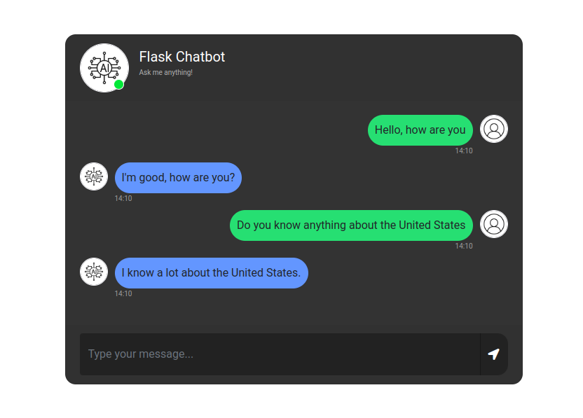

# ChatBot Using DialoGPT & Flask
This is a simple chatbot application made using Flask and Microsoft DialoGPT. The application allows users to chat with the chatbot using natural language and receive human-like responses.

## ChatBot Description
- Carry out conversations with users using natural language processing
- Use Microsoft DialoGPT to generate human-like responses
- Integrate DialoGPT with Flask to create a web application
- Use HTML, CSS, and JavaScript to create a visually appealing and interactive chat interface
- Use jQuery to handle HTTP requests to the backend server

## ChatBot Link
The Chatbot is constructed using the Microsoft/DialoGPT-medium model.
Link: https://huggingface.co/microsoft/DialoGPT-medium

## Installation & Setup
1. Clone the repository
2. Set up a virtual environment by running `python -m venv env` (on Windows) or `python3 -m venv env` (on Linux and macOS)
3. Activate the virtual environment by running `env\Scripts\activate` (on Windows) or `source env/bin/activate` (on Linux and macOS)
4. Install the required packages by running `pip install -r requirements.txt`
5. Note: The requirements will necessitate downloading large amounts of data for the model, so please be cautious about data usage on metered connections.
6. Run the application by running `python app.py`
7. Open a web browser and navigate to http://127.0.0.1:5000/
8. Start chatting with the chatbot using natural language. You can start with a simple question like "Hello", "How are you?".

## Dependencies
The system requires the following dependencies:
- flask
- transformers
- torch

## Screenshot

## License
This project is licensed under the MIT License. See the LICENSE file for more details.

## Visit and Follow
For more details and tutorials, visit the website: [DocsAllOver](https://docsallover.com/).

Follow us on:
- [Facebook](https://www.facebook.com/docsallover)
- [Instagram](https://www.instagram.com/docsallover.tech/)
- [x.com](https://www.x.com/docsallover/)
- [LinkedIn](https://www.linkedin.com/company/docsallover/)
- [YouTube](https://www.youtube.com/@docsallover)
- [Threads.net](https://threads.net/docsallover.tech)

and visit our website to know more about our tutorials and blogs.